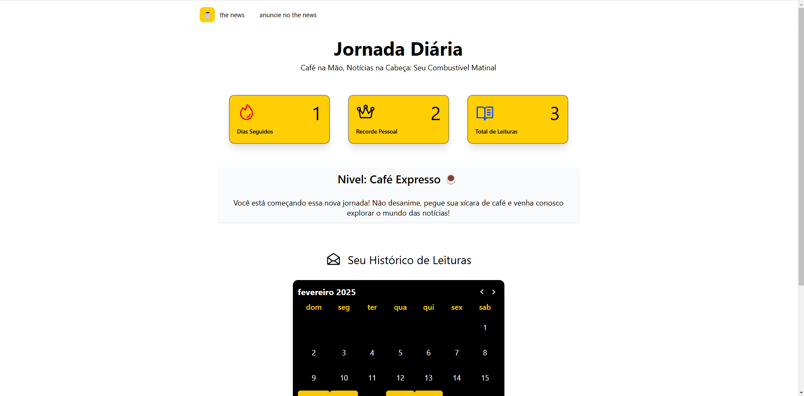
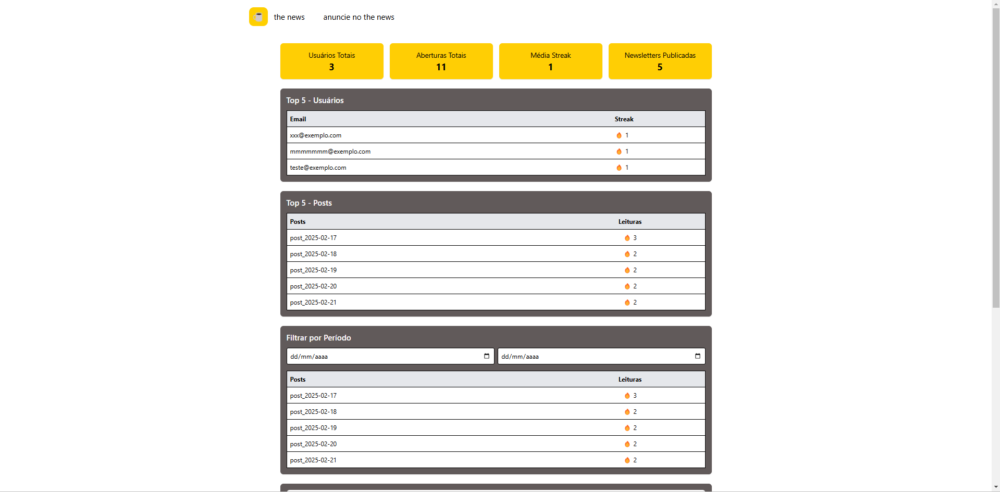
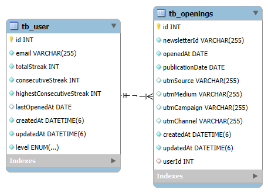

# Gamificação da Newsletter

## Visão Geral

Este projeto implementa um sistema de gamificação para uma newsletter, incentivando o engajamento dos leitores através de um sistema de streaks (sequências de leitura) e diferentes níveis de usuários. Ele é construído utilizando **NestJS**, **TypeORM** e **MySQL** no back-end, e **React TypeScript** no front-end.

## Tecnologias Utilizadas

- **NestJS**: Framework para construção do back-end
- **TypeORM**: ORM para interação com o banco de dados
- **MySQL**: Banco de dados relacional para armazenamento dos dados
- **React com TypeScript**: Para o front-end
- **Tailwind CSS**: Para o estilo da aplicação
- **@phosphor-icons/react**: Para os ícones

## Estrutura do Projeto

O projeto é dividido em:

### Entities

- **User**: Representa um usuário do sistema.
- **Opening**: Representa uma abertura de uma newsletter por um usuário.

### Services

- **UserService**: Gerencia a criação e atualização de usuários.
- **OpeningService**: Registra aberturas de newsletters e gera métricas de engajamento.
- **AppService**: Controla a lógica central do sistema, incluindo a gestão de streaks e níveis.

### Controller

- **AppController**: Expõe as rotas para manipulação dos webhooks e consulta de métricas.

## Funcionamento

### Fluxo de Engajamento

1. Quando um usuário abre uma newsletter, um webhook é disparado para `AppController`.
2. O sistema registra a abertura e verifica se é um novo usuário.
3. Caso seja uma nova abertura, a streak é atualizada com base em regras predefinidas.
4. O usuário recebe um nível baseado na sua sequência de leitura.

### Níveis do Usuário

- **Café Expresso**: Iniciante
- **Macchiato**: 10+ dias consecutivos
- **Barista Mestre**: 30+ dias consecutivos

### Endpoints Disponíveis

- **GET /**: Webhook para registrar abertura de newsletter
- **GET /metrics**: Retorna estatísticas de engajamento, top usuários e top newsletters

## Páginas principais

### 1. **Streak (Página de Jornada do Usuário)**

A página de jornada permite que o usuário acompanhe sua evolução na plataforma, com foco no conceito de "streak" (sequência de dias consecutivos). As principais funcionalidades incluem:

- **Exibição de streaks**: Mostra o número de dias consecutivos que o usuário leu a newsletter, o recorde pessoal de streak e o total de leituras realizadas.
- **Exibição de nível**: Cada usuário é atribuído a um nível (como "Café Expresso", "Macchiato", "Barista Mestre"), com mensagens motivacionais associadas a cada nível.
- **Histórico de leituras**: Através de um calendário interativo, o usuário pode visualizar os dias em que leu as newsletters.

### 2. **Admin (Administração de Métricas)**

A página de administração exibe as métricas gerais sobre o uso da plataforma. Ela oferece um painel de controle para visualizar o desempenho dos usuários e dos posts, além de permitir a filtragem dos dados por período. As principais funcionalidades incluem:

- **Métricas gerais**: Exibição das métricas de usuários, aberturas de newsletters, média de streaks, e total de newsletters publicadas.
- **Ranking dos usuários**: Exibe os 5 usuários mais engajados, com seu e-mail e streak de leituras consecutivas.
- **Ranking dos posts**: Mostra as 5 newsletters mais abertas, com o número de aberturas.
- **Filtragem por período**: Permite ao administrador filtrar as métricas de abertura por um intervalo de datas específico.

## Como Usar

1. Clone o repositório:

   `git clone <URL do repositório>`

   Entre no diretório do projeto:

   `cd <diretório do projeto>`

2. Instale as dependências:

   - **Back-end**: Se estiver rodando o servidor em Node.js, entre no diretório do back-end e execute:

     `npm install`

   - **Front-end**: No diretório do front-end, instale as dependências com:

     `npm install`

3. Configure as variaveis de ambiente:

   - **Back-end**: Crie um arquivo .env na raiz do projeto e preencha conforme o arquivo .env.template.

   - **Front-end**: Crie um arquivo .env na raiz do projeto e preencha conforme o arquivo .env.template.

3.1 Faça um insert no banco de dados:

    INSERT INTO tb_user (id, email, totalStreak, consecutiveStreak, highestConsecutiveStreak, lastOpenedAt, createdAt, updatedAt, level)
    VALUES
    (5, 'teste@exemplo.com', 3, 1, 2, '2025-02-21', '2025-02-17 21:19:16.194772', '2025-02-17 21:21:34.000000', 'Café Expresso');

    INSERT INTO tb_openings (id, userId, newsletterId, openedAt, publicationDate, createdAt, updatedAt)
    VALUES
    (11,5, 'post_2025-02-17', '2025-02-17', '2025-02-17', '2025-02-17 21:19:16.478021', '2025-02-17 21:19:16.478021'),
    (12, 5, 'post_2025-02-18', '2025-02-18', '2025-02-18', '2025-02-17 21:19:25.335071', '2025-02-17 21:19:25.335071'),
    (13, 5, 'post_2025-02-19', '2025-02-20', '2025-02-19', '2025-02-17 21:20:34.317464', '2025-02-17 21:20:34.317464'),
    (14, 5, 'post_2025-02-20', '2025-02-21', '2025-02-20', '2025-02-17 21:21:09.397380', '2025-02-17 21:21:09.397380'),
    (15, 5, 'post_2025-02-21', '2025-02-21', '2025-02-21', '2025-02-17 21:21:34.841535', '2025-02-17 21:21:34.841535');

4. Execute o back-end:

   `npm run start`

5. Execute o front-end:

   `npm run dev`

6. Acesse as páginas:

   - **Admin**: `http://localhost:4000/admin`
   - **Streak**: `http://localhost:4000/streak/teste@exemplo.com`

## Funcionalidades

- Exibição de métricas em tempo real
- Ranking de usuários e posts
- Filtragem de dados por data
- Acompanhamento de streaks e nível do usuário
- Calendário interativo para visualização de leituras passadas

## **🔍 Perguntas a serem Respondidas**

Além do desenvolvimento, os candidatos devem apresentar um breve relatório respondendo:

1. **Stacks**

   - Quais as tecnologias usadas?

   Back-End: NestJS, TypeScript, TypeORM e MySQL
   
   Front-End: React, TypeScript e Tailwind

   - Quais problemas você enfrentou ao desenvolver?

   Os principais desafios estavam relacionados à definição dos requisitos essenciais para o funcionamento do sistema e à estruturação das entidades para suportar esses requisitos. Após definir o escopo do projeto, consegui avançar com o desenvolvimento de forma mais fluida.

   - Qual a organização que escolheu e por quê?

   Para o back-end, optei pelo NestJS devido à sua facilidade de uso e estrutura organizada, o que acelera o desenvolvimento e facilita a manutenção. TypeORM e MySQL foram escolhidos pela sua simplicidade e boa performance. O MySQL foi uma escolha natural, pois se trata de um banco de dados relacional, ideal para esse tipo de aplicação. Para o front-end, utilizei React + Vite, sendo o Vite uma opção superior ao Create React App devido ao seu desempenho mais rápido e à experiência de desenvolvimento otimizada. O TypeScript foi escolhido para garantir tipagem estática, facilitando a manutenção e evitando erros durante o desenvolvimento.

2. **Dados**

   - Qual a estrutura do seu SQL?

   O banco de dados foi projetado com duas principais entidades: User (Usuário) e Openings (Aberturas). A ideia foi manter a estrutura o mais simples possível. A cada leitura de newsletter por um usuário, uma nova entrada é criada em Openings, associando o usuário à newsletter lida. Cada abertura armazena informações relevantes, como as UTMs, data de postagem, data de leitura, entre outros dados.

   

   - Como você lida com as inserções e consultas dos leitores?

   Quando o webhook recebe uma requisição com os dados do usuário, a publicação vista e as UTMs, ele chama a função webHookHandler. Se o usuário não estiver registrado, ele é criado, e a abertura da newsletter é registrada com a data da postagem, data de leitura e as UTMs. Durante esse processo, o sistema também calcula a streak (sequência de leituras consecutivas). Para a consulta, o sistema retorna o usuário completo, permitindo que o front-end exiba as métricas e informações relevantes na página de jornada do usuário.

   - Ele é escalável?

   Sim, o NestJS é altamente escalável. Ele utiliza o servidor Express por baixo, que é capaz de lidar com grandes volumes de requisições, tornando a aplicação robusta e preparada para atender alta demanda.

3. **Testes**

   - Quais testes você realizou?

   Realizei testes manuais e testes unitários para garantir o funcionamento adequado de todas as funcionalidades do sistema. Os testes manuais ajudaram a validar o fluxo completo da aplicação, enquanto os testes unitários garantiram que cada parte do código estivesse funcionando de forma isolada e correta.

   - Quanto tempo levou o desenvolvimento e testes?

   O desenvolvimento e os testes levaram, em média, 30 horas. O trabalho começou no dia 15/02 e foi finalizado no dia 21/02, com uma média de 4 horas diárias dedicadas ao projeto.
